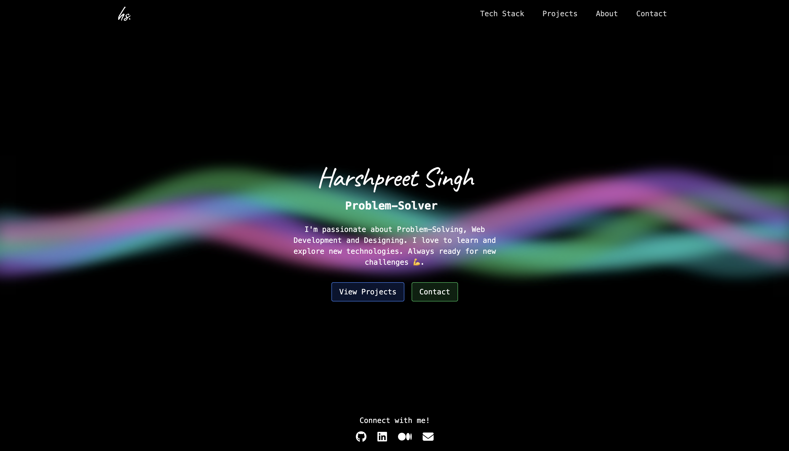
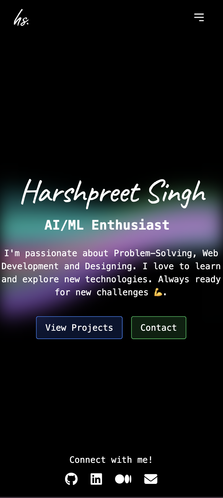

# Modern Portfolio Website

<div align="center">


**A beautiful, modern, and responsive portfolio website built with React, featuring stunning animations and glassmorphism design.**

[🚀 Live Demo](https://harshpreetsingh.vercel.app) • [🐛 Report Bug](https://github.com/harshpreet931/portfolio/issues)

</div>

## Features

-  **Modern Glassmorphism Design** - Beautiful transparent cards with backdrop blur effects
-  **Animated Wavy Background** - Dynamic animated background using Simplex noise
-  **Fully Responsive** - Works perfectly on all devices and screen sizes
-  **Lightning Fast** - Built with Vite for optimal performance
-  **Smooth Animations** - Powered by Framer Motion for buttery smooth transitions
-  **Flip Words Animation** - Eye-catching text animations on the home page
-  **SEO Optimized** - Proper meta tags and structured data
-  **Custom Fonts** - Beautiful typography with Google Fonts integration
-  **Interactive Navigation** - Smooth navigation with active state indicators
-  **Project Showcase** - Elegant project cards with hover effects
-  **Tech Stack Display** - Organized showcase of skills and technologies
-  **Contact Form** - Easy way for visitors to get in touch
-  **Social Links** - Quick access to all social media profiles

## Preview

### Desktop View


### Mobile View


## Quick Start

### Prerequisites

- Node.js (v16 or higher)
- npm or yarn package manager

### Installation

1. **Clone the repository**
   ```bash
   git clone https://github.com/harshpreet931/portfolio.git
   cd portfolio
   ```

2. **Install dependencies**
   ```bash
   npm install
   # or
   yarn install
   ```

3. **Start the development server**
   ```bash
   npm run dev
   # or
   yarn dev
   ```

4. **Open your browser**
   Navigate to `http://localhost:5173` to see the website in action!

### Building for Production

```bash
npm run build
# or
yarn build
```

The built files will be in the `dist` directory, ready for deployment.

##  Customization

### Personal Information

1. **Update personal details** in `src/components/home/home.jsx`:
   ```jsx
   const words = ["Web Developer", "Designer", "AI/ML Enthusiast", "Problem-Solver"];
   ```

2. **Add your projects** in `src/components/projects/projects.jsx`:
   ```jsx
   const projects = [
     {
       title: "Your Project Name",
       github: "https://github.com/your-username/your-project",
       image: "/your-project-image.png",
       description: "Project description",
       tech: ["React", "Node.js", "MongoDB"]
     }
   ];
   ```

3. **Update tech stack** in `src/components/techStack/techStack.jsx`

4. **Replace images** in the `public` directory with your own

### Styling

- Colors and theme can be customized in `tailwind.config.js`
- Custom fonts are located in `src/fonts/`
- Component-specific styles are in their respective directories

##  Responsive Design

The portfolio is built with a mobile-first approach and includes:

- **Mobile**: Optimized for phones (320px+)
- **Tablet**: Perfect for tablets (768px+)  
- **Desktop**: Full desktop experience (1024px+)
- **Large screens**: Optimized for 4K displays (1440px+)

##  Tech Stack

- **Frontend Framework:** React 18
- **Build Tool:** Vite
- **Styling:** TailwindCSS
- **Animations:** Framer Motion
- **Routing:** React Router Dom
- **Background Effects:** Simplex Noise
- **Font Loading:** Custom font integration
- **Deployment:** Vercel (recommended)

##  Project Structure

```
portfolio/
├── public/
│   ├── images/           # Project images and assets
│   └── logo.svg          # Site logo
├── src/
│   ├── components/
│   │   ├── home/         # Home page component
│   │   ├── about/        # About page component
│   │   ├── projects/     # Projects showcase
│   │   ├── techStack/    # Technology skills
│   │   ├── contact/      # Contact form
│   │   ├── loading/      # Loading screen
│   │   ├── socialLinks/  # Social media links
│   │   └── ui/           # Reusable UI components
│   ├── fonts/            # Custom fonts
│   ├── utils/            # Utility functions
│   ├── App.jsx          # Main app component
│   └── main.jsx         # Entry point
├── docs/                 # Documentation and screenshots
└── README.md            # This file
```

##  Key Components

### WavyBackground
An animated background component using Simplex noise for organic wave movements.

### FlipWords
A text animation component that cycles through different words with smooth transitions.

### Project Cards
Interactive project showcase cards with hover effects and technology tags.

### Navigation
Responsive navigation with smooth transitions and active state indicators.

##  Deployment

### Vercel (Recommended)

1. Fork this repository
2. Connect your GitHub account to Vercel
3. Import the project
4. Deploy with one click!

### Netlify

1. Build the project: `npm run build`
2. Drag and drop the `dist` folder to Netlify
3. Your site is live!

### GitHub Pages

1. Install gh-pages: `npm install --save-dev gh-pages`
2. Add to package.json:
   ```json
   "homepage": "https://your-username.github.io/portfolio",
   "scripts": {
     "predeploy": "npm run build",
     "deploy": "gh-pages -d dist"
   }
   ```
3. Deploy: `npm run deploy`

##  Contributing

Contributions are what make the open source community such an amazing place to learn, inspire, and create. Any contributions you make are **greatly appreciated**.

1. Fork the Project
2. Create your Feature Branch (`git checkout -b feature/AmazingFeature`)
3. Commit your Changes (`git commit -m 'Add some AmazingFeature'`)
4. Push to the Branch (`git push origin feature/AmazingFeature`)
5. Open a Pull Request

### Development Guidelines

- Follow the existing code style
- Write meaningful commit messages
- Add comments for complex logic
- Test your changes thoroughly
- Update documentation if needed

##  License

This project is licensed under the MIT License - see the [LICENSE](LICENSE) file for details.

##  Acknowledgments

- [React](https://reactjs.org/) - The web framework used
- [Framer Motion](https://www.framer.com/motion/) - For beautiful animations
- [TailwindCSS](https://tailwindcss.com/) - For utility-first CSS
- [Vite](https://vitejs.dev/) - For lightning-fast builds
- [Vercel](https://vercel.com/) - For hosting and deployment

## About

Harshpreet Singh

Project Link: [https://github.com/harshpreet931/portfolio](https://github.com/harshpreet931/portfolio)

---

<div align="center">

**[⬆ Back to Top](#-modern-portfolio-website)**

Made with ❤️ by [Harshpreet Singh](https://github.com/harshpreet931)

⭐ Star this repo if you found it helpful!

</div>
